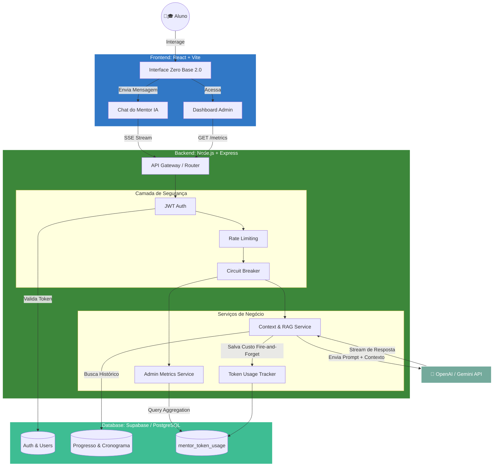

# Zero Base 2.0


> Plataforma de estudos para ENEM e concursos com gamificação, conquistas e análise de progresso.


---

## Instalação Rápida

```bash
# 1. Instale as dependências
npm install

# 2. Inicie o servidor
npm run dev

# 3. Abra no navegador
http://localhost:5173
```

Pronto. O aplicativo estará rodando.

---

## Funcionalidades Principais

### Páginas Disponíveis

- **Início** - Dashboard completo com heatmap e estatísticas
- **Cronômetro** - Timer de estudos com registro automático
- **Dashboard** - Análise detalhada do progresso
- **Conquistas** - Sistema de achievements desbloqueáveis
- **Configurações** - Personalização de temas e preferências
- **Dados** - Backup e gerenciamento completo

### Recursos Especiais

- Sistema de níveis (1-10)
- Conquistas com raridades diferentes
- Heatmap estilo GitHub
- Modo escuro com temas de cores
- Export/Import em CSV e JSON
- Relatórios semanais
- Notificações

---

## Estrutura Principal

```text
src/
  pages/
    Settings.tsx
    Conquistas.tsx
    localStorage.tsx
  components/
    Dashboard/
      StudyHeatmap.tsx
      LevelProgress.tsx
      WeeklyReport.tsx
      AchievementNotification.tsx
  App.tsx
```

---

## Arquitetura do Sistema



---

## Organização do Repositório

- Guia de organização: `docs/ORGANIZACAO_REPOSITORIO.md`
- Autor: Gleydson de Sousa Gomes (Linconl)
- Resumo executivo: `docs/RESUMO_ZERO_BASE_V2.md`
- Índice de arquivos: `INDEX_ARQUIVOS.html`
- Estrutura detalhada: `ESTRUTURA_PROJETO.txt`

---

## Tecnologias

- React + TypeScript
- Vite + Tailwind CSS
- Recharts
- Lucide React
- date-fns

---

## Como Usar

### Primeiro acesso
1. Crie uma conta
2. Configure suas preferências em Configurações

### Registrar estudos
1. Inicie o cronômetro
2. Estude
3. Finalize a sessão

### Backup de dados
1. Abra Dados
2. Baixe o backup em JSON

---

## Problemas Comuns

**Erro: Cannot find module**
```bash
npm install
```

**Porta em uso**
```bash
npm run dev -- --port 3000
```

**Tela branca**
- Limpe cache do navegador
- Recarregue a página

---

## Documentação Adicional

- `GUIA_COMPLETO.md` - Documentação detalhada
- `INICIO_RAPIDO.txt` - Comandos rápidos
- `GUIA_INSTALACAO.html` - Guia visual
- `docs/ORGANIZACAO_REPOSITORIO.md` - Mapa e convenções de organização
- `docs/RESUMO_ZERO_BASE_V2.md` - Resumo executivo consolidado (Notion + repositório)

---

## Comandos Úteis

```bash
npm run dev      # Desenvolvimento
npm run build    # Build de produção
npm run preview  # Preview da build
npm run lint     # Verificar código
npm run test     # Unit tests (Vitest)
npm run e2e      # E2E headless
npm run e2e:open # E2E visual
npm run test:all # Unit + E2E em sequência
```

---

## Testes E2E (Cypress)

O projeto já está configurado com Cypress:

```bash
npm run e2e
npm run e2e:open
npm run test:all
```

CI pronto em `.github/workflows/e2e.yml`.

---

## Licença

MIT License.

---

Versão 2.0.0 | Fevereiro 2026
