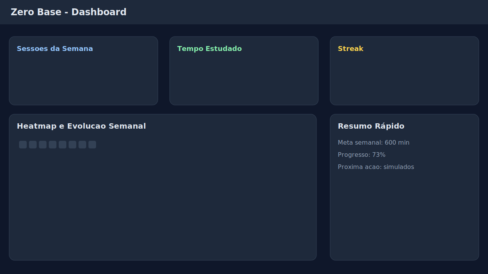
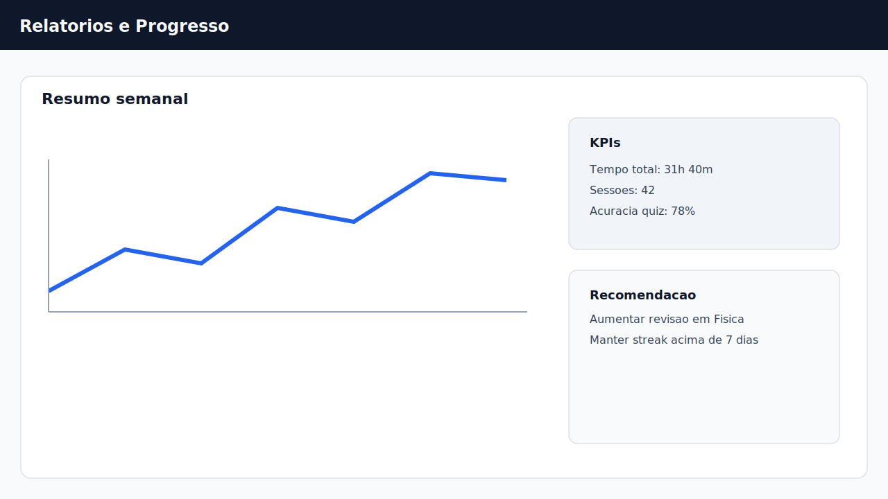

# Zero Base - Pacote Consolidado para Notion (Banca IFPI)

Este arquivo consolida as 7 seções da versão enxuta para banca em formato linear, pronto para colagem no Notion.

---

# 1. Resumo Executivo

## Identificação acadêmica
- Autor: Gleydson de Sousa Gomes (Linconl)
- Orientador: pendente de confirmação institucional
- Curso: Análise e Desenvolvimento de Sistemas - IFPI Campus Picos
- Data desta versão: 14/03/2026

## Contexto
Este trabalho apresenta o desenvolvimento e a consolidação do projeto Zero Base, uma aplicação web voltada prioritariamente para estudantes de medicina, com recursos de acompanhamento de progresso, organização de sessões e feedback visual.

## Objetivo geral
Estruturar uma base técnica sustentável, com documentação padronizada e validação mínima de qualidade, adequada para continuidade evolutiva do projeto.

## Escopo executado
- reorganização e padronização documental;
- consolidação de nomenclatura para Zero Base;
- ajustes em testes E2E e fluxo de CI para maior estabilidade em PR;
- síntese técnica para governança (resumos, relatórios e plano de execução).

## Resultado consolidado
O projeto permanece funcional, com repositório organizado, histórico de mudanças rastreável e documentação orientada para manutenção e apresentação acadêmica.

## Evidências principais
- Link do repositório: https://github.com/L1nconlLast/Zero-Base
- Link da branch principal: https://github.com/L1nconlLast/Zero-Base/tree/main
- Link da página principal no Notion: https://www.notion.so/Zero-Base-Projeto-Completo-3019fab2320281b8995de6936d589f55
- Link da análise completa no Notion: https://www.notion.so/An-lise-Completa-O-que-Melhorar-e-Aprimorar-3219fab23202811980a8e94c848006b3
- Status do demo online (14/03/2026): https://zero-base-three.vercel.app ativo e acessível em produção.

## Status da documentação
- Responsável: Gleydson de Sousa Gomes (Linconl)
- Data desta versão: 14/03/2026

---

# 2. Problema e Objetivos

## Problema
Estudantes de medicina lidam com alta densidade de conteúdo, carga horária extensa e dificuldade de manter regularidade de estudo com feedback visível de progresso. Em paralelo, projetos acadêmicos com crescimento incremental tendem a acumular inconsistências de nomenclatura, documentação dispersa e dificuldade de rastrear entregas técnicas de forma objetiva.

## Hipótese de trabalho
A adoção de um padrão de documentação enxuto, aliado a evidências técnicas (commits, testes e checklist), melhora a clareza de apresentação e reduz ambiguidades na avaliação do projeto.

## Contexto setorial e referências de base
- Segundo o Conselho Federal de Medicina (CFM), o Brasil mantém grande contingente de estudantes e cursos de medicina, reforçando a relevância de soluções voltadas à gestão da rotina acadêmica. Fonte: https://portal.cfm.org.br/
- As Diretrizes Curriculares Nacionais do curso de Medicina vinculadas ao MEC/CNE reforçam a elevada carga formativa do curso. Fonte: https://www.gov.br/mec/ e Resolução CNE/CES n. 3/2014.

## Objetivo geral
Organizar o projeto Zero Base com foco em rigor técnico e comunicabilidade acadêmica.

## Objetivos específicos
1. Padronizar nomenclatura e artefatos de documentação.
2. Consolidar melhorias implementadas em uma linha narrativa verificável.
3. Definir estrutura de apresentação com inicio, método, resultados e limitações.
4. Vincular resultados a evidências técnicas rastreáveis.

## Critérios de sucesso
- documentação principal consistente com o estado do código;
- histórico de mudanças versionado e auditável;
- apresentação objetiva em até 10 minutos, sem dependência de narrativa promocional.

---

# 3. Metodologia e Desenvolvimento

## Abordagem metodológica
Foi adotada uma abordagem incremental em ciclos curtos:
1. diagnóstico do estado do repositório e documentação;
2. definição de padronização mínima necessária;
3. implementação de ajustes com versionamento;
4. validação por testes e revisão de consistência documental.

## Procedimentos executados
- revisão de titulos, nomes de projeto e artefatos de referência;
- criação de documentação de síntese (resumo executivo e plano profissional);
- ajuste de testes E2E para reduzir fragilidade em fluxo de PR;
- atualização de fluxo de CI para separar smoke em PR e execução completa em push.

## Ferramentas
- controle de versão: Git/GitHub;
- documentação: Markdown + Notion;
- stack do projeto: React, TypeScript, Vite 5.x;
- qualidade: Vitest e Cypress.

## Ambiente e evidências técnicas
- Sistema operacional de desenvolvimento: Windows.
- Commit de consolidação documental: `393ffed`
- Commit de atualização do README: `af93460`
- Commit do plano profissional e governança: `c6b2856`
- Commit da publicação da documentação da banca: `7ddb7d7`
- Commit da atualização do backend Mentor e pipeline: `64f7f59`

## Siglas adotadas
- Progressive Web App (PWA): aplicação web instalável com capacidades de cache e uso parcial offline.

## Estratégia de validação
- validação de integridade do repositório (estado limpo e histórico de commits);
- validação de execução de testes em escopo de smoke;
- revisão final de coerência entre documentos e mudanças aplicadas.

## Reprodutibilidade
Os resultados são reproduzíveis por meio do histórico de commits, arquivos versionados e pipeline configurado no repositório.

---

# 4. Resultados e Validação

## Resultados observados
- padronização de nomenclatura para Zero Base em documentos críticos;
- criação de pacote documental objetivo para contexto acadêmico;
- melhoria da previsibilidade do fluxo de teste em integração contínua;
- registro de melhorias técnicas e operacionais em artefatos versionados.
- geração de evidências visuais e relatório Lighthouse real a partir da demo publicada.

## Indicadores qualitativos
- maior rastreabilidade das alterações;
- redução de ambiguidades na comunicação técnica;
- melhor separação entre documentação de produto e documentação para banca.

## Indicadores quantitativos (quando aplicável)
Métricas preenchidas com base em execução local em 14/03/2026:

Tabela 1 - Métricas reais de validação técnica do Zero Base

| Métrica | Valor Real | Método de Coleta | Evidência |
| --- | --- | --- | --- |
| Testes unitários | 128 testes aprovados em 12 arquivos | Execução de `npm run test -- --run` | Saída do Vitest (sem falhas) |
| Build de produção | concluído em 8.45s | Execução de `npm run build` | Saída do Vite com build finalizado |
| PWA (precache) | 67 entradas, 2281.42 KiB | Execução de `npm run build` (plugin PWA) | Bloco final da saída: `precache 67 entries` |
| Lighthouse - Performance | 99 | Execução de `npx lighthouse https://zero-base-three.vercel.app` | `docs/banca_ifpi/assets/lighthouse-report.report.html` |
| Lighthouse - Accessibility | 98 | Execução de `npx lighthouse https://zero-base-three.vercel.app` | `docs/banca_ifpi/assets/lighthouse-report.report.html` |
| Lighthouse - Best Practices | 100 | Execução de `npx lighthouse https://zero-base-three.vercel.app` | `docs/banca_ifpi/assets/lighthouse-report.report.html` |
| Entregas recentes | 36 commits desde 01/03/2026 (HEAD local) | Execução de `git rev-list --count --since='2026-03-01' HEAD` | Saída do Git com total de commits |
| Status da demo pública | ativa em produção | Deploy Vercel + verificação de URL pública | `https://zero-base-three.vercel.app` acessível em 14/03/2026 |

## Testes com usuários - síntese descritiva
Tabela 2 - Registro resumido de feedbacks exploratórios

| Perfil | Modalidade | Objetivo observado | Feedback resumido |
| --- | --- | --- | --- |
| Estudante da área da saúde 1 | exploração guiada | compreender dashboard e progresso | navegação clara, mas pediu mais destaque para metas semanais |
| Estudante da área da saúde 2 | uso livre | testar timer e rotina | considerou o timer útil para foco e revisão curta |
| Estudante da área da saúde 3 | exploração guiada | interpretar relatórios e gamificação | achou relatórios úteis, sugeriu notificações em evolução futura |

Observação: esta tabela resume validação exploratória informal e não substitui estudo com protocolo formal e termo de consentimento.

## Validação mínima recomendada
1. Repositório em estado limpo após as alterações.
2. Commits publicados na branch principal.
3. Execução de testes de smoke sem falhas críticas.
4. Documentação principal atualizada e coerente.

## Conclusão desta etapa
A etapa de organização técnica foi concluída com foco em evidência, mantendo escopo realista e aderência ao contexto acadêmico.

---

# 5. Limitações e Trabalhos Futuros

## Limitações identificadas
- parte das métricas históricas depende de comprovação detalhada adicional;
- algumas melhorias arquiteturais estruturais permanecem como evolução futura;
- a documentação no Notion pode divergir do repositório sem rotina de sincronização.

## Riscos de continuidade
- divergência entre planejamento e execução real;
- priorização excessiva de documentação sem avanço funcional proporcional;
- perda de rastreabilidade caso evidências não sejam anexadas periodicamente.

## Trabalhos futuros (priorizados)
### Curto prazo
- completar evidências objetivas de métricas relevantes;
- revisar periodicamente alinhamento entre Notion e repositório;
- manter ritual semanal de atualização de mudanças.

### Médio prazo
- aprofundar padronização de modelos de dados e validação;
- ampliar cobertura de testes em áreas críticas;
- refinar monitoramento de qualidade do fluxo de entrega.

### Longo prazo
- consolidar governança de produto com metas trimestrais;
- expandir uso acadêmico para portfólio técnico com material de demonstração.

---

# 6. Apêndices Técnicos e Evidências

## A) Evidências de versionamento
- commit de consolidação documental: `393ffed`
- commit de atualização do README: `af93460`
- commit de plano profissional (KPIs e governança): `c6b2856`

## B) Evidências de qualidade
- resultado de teste de qualidade (14/03/2026): `npm run test -- --run` executado com sucesso (12 arquivos e 128 testes aprovados).
- referência de workflow CI: `.github/workflows/e2e.yml`
- referência de workflow CI adicional: `.github/workflows/ci.yml`
- evidência de estado limpo após publicação: pendente (capturar print do `git status` após próximo ciclo de commit/push).
- relatório Lighthouse real gerado em `assets/lighthouse-report.report.html` e `assets/lighthouse-report.report.json`.

## C) Evidências visuais
Apêndice A - Capturas e imagens do produto

1. Tela inicial/dashboard:

2. Fluxo de timer ou sessão de estudo:

3. Visão de progresso/relatórios:

4. Diagrama de arquitetura:

5. Roadmap/documentação no Notion:
- Página principal: https://www.notion.so/Zero-Base-Projeto-Completo-3019fab2320281b8995de6936d589f55?pvs=18
- Análise de pendências: https://www.notion.so/An-lise-Completa-O-que-Melhorar-e-Aprimorar-3219fab23202811980a8e94c848006b3?source=copy_link

## D) Apêndice B - Relatório Lighthouse
- Arquivo HTML: `assets/lighthouse-report.report.html`
- Arquivo JSON: `assets/lighthouse-report.report.json`
- Scores registrados em 14/03/2026: Performance 99, Accessibility 98, Best Practices 100.

## E) Apêndice C - Evidências de desenvolvimento
- Commits com hashes reais listados nas seções de versionamento e em `07_MUDANCAS_DA_SEMANA.md`.
- Repositório público: https://github.com/L1nconlLast/Zero-Base

## F) Apêndice D - Plataformas de referência
- Forest: https://www.forestapp.cc/
- Habitica: https://habitica.com/

## G) Metodologia de medição (modelo)
Para cada métrica:
- nome da métrica;
- definição operacional;
- ferramenta/comando de coleta;
- data da medição;
- resultado;
- observações de validade.

## H) Estrutura de código (síntese)
Referenciar:
- módulos principais em `src/`;
- artefatos de documentação em `docs/`;
- configuração de testes e CI.

## I) Referências técnicas
1. REACT TEAM. React Documentation. 2024-2026. Disponível em: https://react.dev/. Acesso em: 14 mar. 2026.
2. MICROSOFT. TypeScript Documentation. 2024-2026. Disponível em: https://www.typescriptlang.org/docs/. Acesso em: 14 mar. 2026.
3. VITE TEAM. Vite Documentation (v5). 2024-2026. Disponível em: https://vite.dev/guide/. Acesso em: 14 mar. 2026.
4. OWASP FOUNDATION. OWASP Top 10:2021 - The Ten Most Critical Web Application Security Risks. 2021. Disponível em: https://owasp.org/Top10/. Acesso em: 14 mar. 2026.
5. GOOGLE. web.dev - Progressive Web Apps. 2024-2026. Disponível em: https://web.dev/learn/pwa/. Acesso em: 14 mar. 2026.
6. CYPRESS. Cypress Documentation. 2024-2026. Disponível em: https://docs.cypress.io/. Acesso em: 14 mar. 2026.
7. VITEST TEAM. Vitest Documentation. 2024-2026. Disponível em: https://vitest.dev/guide/. Acesso em: 14 mar. 2026.
8. FOREST. Forest - Stay focused, be present. Disponível em: https://www.forestapp.cc/. Acesso em: 14 mar. 2026.
9. HABITICA. Habitica - Gamify your life. Disponível em: https://habitica.com/. Acesso em: 14 mar. 2026.

---

# 7. Mudanças da Semana

## Semana de 03/03/2026
- `413cc16`: reforço de segurança de auth/deploy, analytics de retenção e expansão de fluxos sociais/estudo.
- `e95616c`: implementação de sincronização offline com fila local e resolução de conflitos.
- `0aca082`: merge automático e histórico de conflitos no fluxo offline.
- `22037b0`: realtime para desafios e ranking social.

## Semana de 11/03/2026
- `32f19de`: hardening do Mentor IA com autenticação, rate limit e streaming SSE.
- `4e0cd24`: integração do Mentor IA com API backend.
- `e9b7836`: criação da tabela de telemetria `mentor_token_usage`.
- `bb8914d`: dashboard administrativo de custos/métricas do Mentor.
- `1c95309`: circuit breaker, filtros por período e exportação CSV no painel admin.

## Links diretos dos commits
- https://github.com/L1nconlLast/Zero-Base/commit/413cc16
- https://github.com/L1nconlLast/Zero-Base/commit/e95616c
- https://github.com/L1nconlLast/Zero-Base/commit/0aca082
- https://github.com/L1nconlLast/Zero-Base/commit/22037b0
- https://github.com/L1nconlLast/Zero-Base/commit/32f19de
- https://github.com/L1nconlLast/Zero-Base/commit/4e0cd24
- https://github.com/L1nconlLast/Zero-Base/commit/e9b7836
- https://github.com/L1nconlLast/Zero-Base/commit/bb8914d
- https://github.com/L1nconlLast/Zero-Base/commit/1c95309

## Observações para banca
- O histórico acima foi extraído do `git log` local em 14/03/2026.
- A cadência de entrega demonstra desenvolvimento incremental com entregas técnicas rastreáveis.