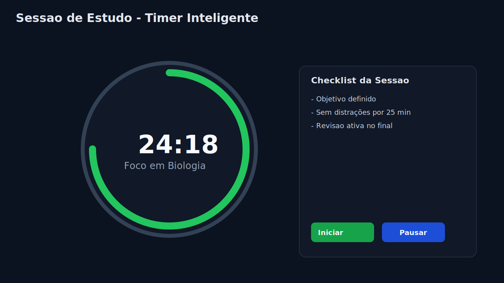
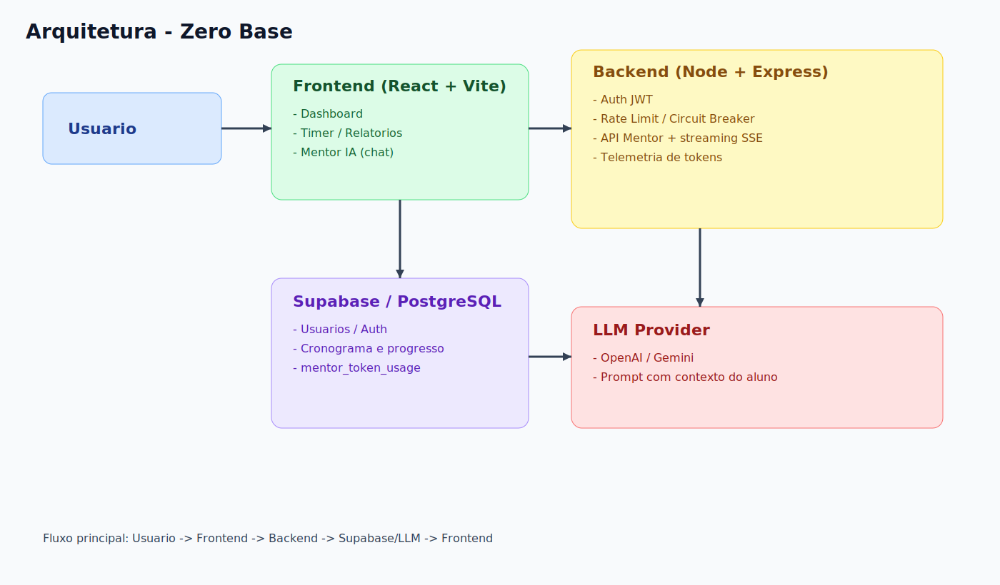

# 6. Apêndices Técnicos e Evidências

## A) Evidências de versionamento
- commit de consolidação documental: `393ffed`
- commit de atualização do README: `af93460`
- commit de plano profissional (KPIs e governança): `c6b2856`
- commit de fechamento do pacote da banca: `7ddb7d7`
- commit de atualização do backend Mentor e pipeline: `64f7f59`

## B) Evidências de qualidade
- resultado de teste de qualidade (14/03/2026): `npm run test -- --run` executado com sucesso (12 arquivos e 128 testes aprovados).
- referência de workflow CI: `.github/workflows/e2e.yml`
- referência de workflow CI adicional: `.github/workflows/ci.yml`
- evidência de estado limpo após publicação: pendente (capturar print do `git status` após próximo ciclo de commit/push).

## C) Evidências visuais
Apêndice A - Capturas e imagens do produto

1. Tela inicial/dashboard:

2. Fluxo de timer ou sessão de estudo:

3. Visão de progresso/relatórios:

4. Diagrama de arquitetura:

5. Roadmap/documentação no Notion:
- Página principal: https://www.notion.so/Zero-Base-Projeto-Completo-3019fab2320281b8995de6936d589f55?pvs=18
- Análise de pendências: https://www.notion.so/An-lise-Completa-O-que-Melhorar-e-Aprimorar-3219fab23202811980a8e94c848006b3?source=copy_link

## D) Apêndice B - Relatório Lighthouse
- Arquivo HTML: `assets/lighthouse-report.report.html`
- Arquivo JSON: `assets/lighthouse-report.report.json`
- Scores registrados em 14/03/2026: Performance 99, Accessibility 98, Best Practices 100.

## E) Apêndice C - Evidências de desenvolvimento
- Commits com hashes reais listados nas seções A e em `07_MUDANCAS_DA_SEMANA.md`.
- Repositório público: https://github.com/L1nconlLast/Zero-Base

## F) Apêndice D - Plataformas de referência
- Forest: https://www.forestapp.cc/
- Habitica: https://habitica.com/

## G) Metodologia de medição (modelo)
Para cada métrica:
- nome da métrica;
- definição operacional;
- ferramenta/comando de coleta;
- data da medição;
- resultado;
- observações de validade.

## H) Estrutura de código (síntese)
Referenciar:
- módulos principais em `src/`;
- artefatos de documentação em `docs/`;
- configuração de testes e CI.

## I) Referências técnicas
1. REACT TEAM. React Documentation. 2024-2026. Disponível em: https://react.dev/. Acesso em: 14 mar. 2026.
2. MICROSOFT. TypeScript Documentation. 2024-2026. Disponível em: https://www.typescriptlang.org/docs/. Acesso em: 14 mar. 2026.
3. VITE TEAM. Vite Documentation (v5). 2024-2026. Disponível em: https://vite.dev/guide/. Acesso em: 14 mar. 2026.
4. OWASP FOUNDATION. OWASP Top 10:2021 - The Ten Most Critical Web Application Security Risks. 2021. Disponível em: https://owasp.org/Top10/. Acesso em: 14 mar. 2026.
5. GOOGLE. web.dev - Progressive Web Apps. 2024-2026. Disponível em: https://web.dev/learn/pwa/. Acesso em: 14 mar. 2026.
6. CYPRESS. Cypress Documentation. 2024-2026. Disponível em: https://docs.cypress.io/. Acesso em: 14 mar. 2026.
7. VITEST TEAM. Vitest Documentation. 2024-2026. Disponível em: https://vitest.dev/guide/. Acesso em: 14 mar. 2026.
8. FOREST. Forest - Stay focused, be present. Disponível em: https://www.forestapp.cc/. Acesso em: 14 mar. 2026.
9. HABITICA. Habitica - Gamify your life. Disponível em: https://habitica.com/. Acesso em: 14 mar. 2026.
